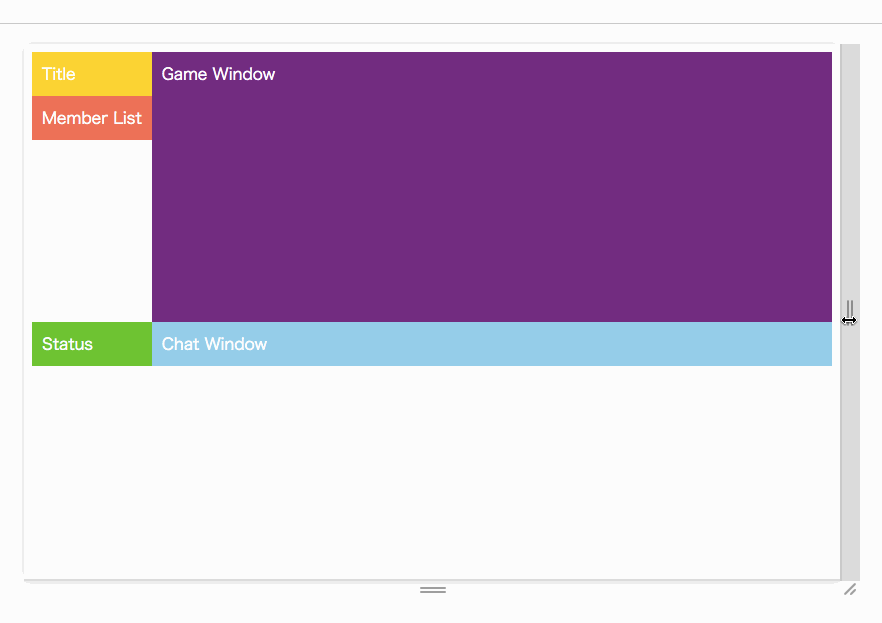

# 今日から使えるCSS Grid

[builderscon tokyo 2017](https://builderscon.io/tokyo/2017)

---

## 0. はじめに

↓

------

### 話している人


- 坂巻 翔大郎（@GeckoTang）
- [株式会社ピクセルグリッド](https://www.pxgrid.com/) フロントエンド・エンジニア
- [Twitter](https://twitter.com/GeckoTang) , [GitHub](https://github.com/geckotang)
- CSSが好きな人
- [CSS PANIC](http://jsdo.it/GeckoTang/4rXg/fullscreen)（2012年）を作りました

------

### 昔作ったもの

<iframe src="http://jsrun.it/GeckoTang/4rXg" frameborder="0" style="width: 470px; height: 500px;"></iframe>

JSは使ってません...

------

### 今日話すこと

1. 現在までの様々なレイアウト方法
2. CSS Gridとは
3. CSS Gridではどんなレイアウトができる？
4. 各ブラウザの実装状況
5. CSS Gridを理解するための基礎知識
6. CSS Gridの使い所や、Flexboxとの使い分け
7. まとめ

---

## 1. 現在までの<br>様々なレイアウト方法

- `<table>`
- float
- position
- table-cell
- inline-block
- Flexbox
- CSS Grid (New!)

------

## `<table>`, float, position

- 昔はよく使った。

------

## display: table-cell; <br> display: inline-block;

- 少し前はIE8でも使える`table-cell`や`inline-block`を多用していた。

------

## Flexbox

- 一昨年〜去年あたりで、一躍有名になり、よく使われるようになった印象。

------

## CSS Grid

- 今年になり遂に、多くのブラウザでサポートされた！

---

## 2. CSS Gridとは

> 要約
> 
> この仕様は、 UI 設計に最適化された二次元格子に基づくレイアウトシステムについて述べる。 格子レイアウトモデルにおいては、格子コンテナの一連の子を，予め定義された flexible ／固定的な サイズのレイアウト格子の中の任意のスロットに位置させられる。

- [CSS Grid Layout Module Level 1](https://www.w3.org/TR/css-grid-1/)
- [CSS 格子レイアウト — CSS Grid Layout Module Level 1](https://triple-underscore.github.io/css-grid-ja.html)

------

### ウェブサイト・アプリは<br>複雑なレイアウトになっている

- `<table>`だけだと無理、そもそも表組み用
- floatだけだと無理、そもそも文章レイアウト用
- Flexboxもあるけど、ちょっと足りてない
- CSS Gridはそのために作られた

------

### CSS Gridは<br>グリッドレイアウトを作りやすい


- `<table>`を使ったテーブルレイアウトに似ている
- `<table>`のようにHTML側でレイアウト構造を作るのではなく、CSS側でレイアウト構造を作ることができる

------

### 例：HTML


- レイアウト情報をCSS側に持つので、HTMLの構造がシンプルに

------

### 例：CSS（広い画面用）


- CSSではどういう分割にするか、どこに配置するかを指定する。

------

### 例：CSS（狭い画面用）


- メディアクエリを使い、レイアウトを組み替える

------

### こうなる



---

## 3. CSS Gridではどんな<br>レイアウトができる？

<hr>

真のグリッドレイアウトができる

------

### ウェブサイト


ウェブサイトの大枠のレイアウトを作る

------

### ウェブサイト（レスポンシブ対応）


画面幅によってレイアウトを変更する

------

### 縦横に揃える必要のあるリスト


行の高さであったり、列の幅を揃える

------

### フォーム


テーブルを使わないで、<br>グリッドレイアウトのフォームを作る

------

### 雑誌の誌面のようなレイアウト


複雑なグリッドレイアウトも作れる

------

### Flexboxでも可能かもしれないが...

- Flexboxは**縦・横どちらか**の整列ができる
- CSS Gridは**縦と横の整列**ができる
- FlexboxにもGridにも、それぞれ得意なレイアウトがある
- 縦横に整列させたいのであればCSS Gridが向いている
- CSS Gridの場合、HTMLの構造もシンプルになる<small style="vertical-align: middle;">（と思う）</small>

---

## 4. 各ブラウザの実装状況

[Can I use...](http://caniuse.com/#feat=css-grid)

- 😍 Edge 16, Chrome, Firefox, Safari, iOS Safari
- 🤔 IE 10+, Edge 15

------

### IE 10+とEdge 15

- IE 10で誰よりも早くCSS Gridを実装（2012年！）した
- IE 10とIE 11は[古い仕様](https://www.w3.org/TR/2011/WD-css3-grid-layout-20110407/)を参照している
- Edgeもまた古い仕様を参照していたが、次のバージョンで新しい仕様に対応する
- IE...

------

### おまけ：IE 10+で使える・使えない<br>CSS Grid関連プロパティ

- IE10+では、グリッドアイテムの自動配置や、グリッドエリアに名前をつける事ができない（辛い）。
- CSS Gridを使えるけど、色々使えないということを覚えておく。

------

<table class="table-of-grid">
<colgroup>
<col style="width: 25%;">
<col style="width: 30%;">
<col style="width: 18%;">
<col style="">
</colgroup>
<thead>
<tr>
<th>仕様のプロパティ</th>
<th>IE10+のプロパティ</th>
<th>Autoprefixerで対応</th>
<th>補足</th>
</tr>
</thead>
<tbody>
<tr class="--yes">
<td>grid-template-columns</td>
<td>-ms-grid-columns</td>
<td>✅</td>
<td></td>
</tr>
<tr class="--yes">
<td>grid-template-rows</td>
<td>-ms-grid-rows</td>
<td>✅</td>
<td></td>
</tr>
<tr>
<td>grid-template-areas</td>
<td>-</td>
<td>😢</td>
<td></td>
</tr>
<tr>
<td>grid-template</td>
<td>-</td>
<td>😢</td>
<td>ショートハンド</td>
</tr>
<tr>
<td>grid-auto-columns</td>
<td>-</td>
<td>😢</td>
<td></td>
</tr>
<tr>
<td>grid-auto-rows</td>
<td>-</td>
<td>😢</td>
<td></td>
</tr>
<tr>
<td>grid-auto-flow</td>
<td>-</td>
<td>😢</td>
<td></td>
</tr>
<tr>
<td>grid</td>
<td>-</td>
<td>😢</td>
<td>ショートハンド</td>
</tr>
<tr class="--yes">
<td>grid-row-start</td>
<td>-ms-grid-row</td>
<td>✅</td>
<td></td>
</tr>
<tr class="--yes">
<td>grid-column-start</td>
<td>-ms-grid-column</td>
<td>✅</td>
<td></td>
</tr>
<tr>
<td>grid-row-end</td>
<td>-</td>
<td>😢</td>
<td>`-ms-grid-row-span`で定義する</td>
</tr>
<tr>
<td>grid-column-end</td>
<td>-</td>
<td>😢</td>
<td>`-ms-grid-column-span`で定義する</td>
</tr>
<tr class="--yes">
<td>grid-row</td>
<td>-</td>
<td>✅（始端の値のみ）</td>
<td>始端と終端をまとめて指定する</td>
</tr>
<tr class="--yes">
<td>grid-column</td>
<td>-</td>
<td>✅（始端の値のみ）</td>
<td>始端と終端をまとめて指定する</td>
</tr>
<tr>
<td>grid-area</td>
<td>-</td>
<td>😢</td>
<td></td>
</tr>
<tr>
<td>grid-row-gap</td>
<td>-</td>
<td>😢</td>
<td>余白の列や行を作り対応</td>
</tr>
<tr>
<td>grid-column-gap</td>
<td>-</td>
<td>😢</td>
<td></td>
</tr>
<tr>
<td>grid-gap</td>
<td>-</td>
<td>😢</td>
<td></td>
</tr>
<tr>
<td>-</td>
<td>-ms-grid-column-span</td>
<td>😇</td>
<td>今の仕様に含まれない</td>
</tr>
<tr>
<td>-</td>
<td>-ms-grid-row-span</td>
<td>😇</td>
<td>今の仕様に含まれない</td>
</tr>
<tr class="--yes">
<td>align-self</td>
<td>-ms-grid-column-align</td>
<td>✅</td>
<td>CSS Box Alignment Moduleの一部へ</td>
</tr>
<tr class="--yes">
<td>justify-self</td>
<td>-ms-grid-row-align</td>
<td>✅</td>
<td>CSS Box Alignment Moduleの一部へ</td>
</tr>
</tbody>
</table>

---

## 5. CSS Gridを理解するための基礎知識

- グリッドコンテナとグリッドアイテム
- グリッドライン
- グリッドトラック
- グリッドセル
- グリッドエリア

<hr>

用語が多い。覚えておくと理解を助ける。

------

### グリッドコンテナとグリッドアイテム


- グリッドコンテナ：親。大枠を決める。
- グリッドアイテム：子。どの枠に入るかを決める。

------

### グリッドコンテナ

- `display: grid;`または`display: inline-grid;`が指定された要素。グリッドの分割数や、分割されたグリッドの列や行の幅や高さといった、レイアウト情報を指定する。

```html
<div class="grid"></div>
```

```css
.grid {
  /* グリッドコンテナの指定 */
  display: grid;
  grid-template-columns: 100px 100px;
  grid-template-rows: 100px 100px;
}
```

------

### グリッドアイテム

- グリッドコンテナの直下の子要素をグリッドアイテムと呼ぶ。グリッドアイテムには、分割されたグリッドのどこに位置するかなどを指定する。

```html
<div class="grid"><!-- グリッドコンテナ -->
  <div class="grid__item-1">item</div> <!-- グリッドアイテム -->
  <div class="grid__item-2">item</div> <!-- グリッドアイテム -->
  <div class="grid__item-3">item</div> <!-- グリッドアイテム -->
  <div class="grid__item-4">item</div> <!-- グリッドアイテム -->
</div>
```

```css
/* グリッドコンテナの指定 */
.grid {
  display: grid;
  grid-template-columns: 100px 100px;
  grid-template-rows: 100px 100px;
}
/* グリッドアイテムの指定 */
.grid__item-1 { grid-column: 1; grid-row: 1; }
.grid__item-2 { grid-column: 2; grid-row: 1; }
.grid__item-3 { grid-column: 1; grid-row: 2; }
.grid__item-4 { grid-column: 2; grid-row: 2; }
```

------

### グリッドライン


- グリッドラインは、グリッドを横方向・縦方向に分割する罫線のこと。
- そのグリッドラインは太さがなく、見た目には現れない。

------

### 名前付きグリッドライン


- グリッドラインには制作者自身が名前を付けることもでき、各列や行のサイズ指定の前後に`[first]`のように記述する。

```css
.grid {
  display: grid;
  grid-template-columns: [first] 100px [second] 200px [last]; /* 2列 */
  grid-template-rows: [first] 100px [second] auto [third] auto [last]; /* 3行 */
}
```

------

### グリッドトラック


- グリッドトラックは、各列や行を意味する。
- グリッドトラックのサイズなどを指定するためには、`grid-template-columns`や`grid-template-rows`プロパティをグリッドコンテナに指定する。

------

### グリッドセル


- 行のグリッドトラックと列のグリッドトラックが交差する箇所を「グリッドセル」と呼ぶ。次のように指定した場合は、縦横100pxのグリッドセルが4つ作成される。

```css
.grid {
  grid-template-columns: 100px 100px;
  grid-template-rows: 100px 100px;
}
```

------

### グリッドエリア


- 複数の行と列のグリッドトラックが交差する範囲は「グリッドエリア」と呼ぶ。

------

### 例：グリッドエリアの指定（HTML）


3行2列に分割して、要素を配置したい

------

### 例：グリッドエリアの指定（CSS）


アスキーアートのように配置できる

------

### グリッドエリアと<br>名前付きグリッドライン


- グリッドエリアを作成すると、自動的にそれらの名前が付いたグリッドラインが作成される。
- たとえば**グリッドエリアa**であれば、そのエリアの**始端辺はa-start**となり、**終端辺はa-end**というように**-start**と**-end**という接尾辞が付与されたグリッドラインが自動的に作成される。

---


## 6. CSS GridとFlexboxの<br>使い分け

- CSS Gridが向いているものを理解する
- Flexboxが向いているものを理解する
- 実際のウェブサイトのココは○○

------

### CSS Gridが向いているもの


- グリッドレイアウト
- 大きい部分で言えば、ウェブサイトの大枠
- 小さい部分で言えば、縦横に揃える必要のあるリスト
- 行と列でアイテムを揃える必要があるならCSS Grid

------

### Flexboxが向いているもの


- 横または、縦に並ぶ直線的なUI
- タブ、サイドメニュー、ページ送り、パンくずリスト
- 行ごと、列ごとにアイテムを揃えるのであればFlexbox

------

### 実際のウェブサイトのココは○○


仮にこのようなサイトを作るとして。

------

### サイトの大枠部分のレイアウト


- CSS Gridを使う

------

### リスト部分のレイアウト


- 縦と横に揃える必要がある
- CSS Gridを使う。<small style="vertical-align: middle;">（Flexboxでも頑張れば可能ではある）</small>

------

### UI（検索フォーム、パンくず、タブ）


- 横または、縦方向に要素が並ぶもの
- Flexboxを使う

------

### 画像と文章のレイアウト


- テキストを回り込ませるのであれば、floatを使う
- そうでないならFlexbox
- 場合によってはCSS Grid

------

### つまり

- 大枠のレイアウト → **CSS Grid**
- リストのレイアウト → **CSS Grid**, **Flexbox**
- UIのレイアウト → **Flexbox**
- 画像と文章のレイアウト → **float**, **Flexbox**, **CSS Grid**

<hr>

のように使い分けると良さそう

---

## 7. まとめ

- CSS Gridはもう使える
- グリットレイアウトといえばCSS Grid
- レイアウトに合わせた適切な使い分けをする
- IE11に対応するのであれば、使えない機能を把握しておく

---

### 記事書いてます


- 執筆陣は現役のフロントエンド・エンジニア
- 基礎から最新トレンド技術まで読みたいときにすぐ読める
- [Web](https://app.codegrid.net/)・[iOSアプリ](https://itunes.apple.com/jp/app/codegrid/id1122952912?mt=8) × メールマガジン
- 月額800円<small style="vertical-align: middle;">（税抜）</small>で、全記事アクセス＋月4回配信
- 無料記事、無料購読期間あります
- [CodeGrid - これからのグリッドレイアウト 全6回](https://app.codegrid.net/series/2016-display-grid)

---

## 参考

- [CodeGrid - これからのグリッドレイアウト -  Grid Layout Moduleの概要](https://app.codegrid.net/entry/display-grid-1)
- [ICS MEDIA - これからのレイアウトはGrid Layoutで決まり？特徴で使い分けたいCSSレイアウト手法](https://ics.media/entry/15921)
- [Rachel Andrew氏のブログ](https://rachelandrew.co.uk/archives/)
- [A Step by Step Guide to the Auto-Placement Algorithm in CSS Grid](https://www.sitepoint.com/a-step-by-step-guide-to-the-auto-placement-algorithm-in-css-grid/)
- [CSS Grid Ask Me Anything](https://github.com/rachelandrew/cssgrid-ama)
- [The Experimental Layout Lab of Jen Simmons](http://labs.jensimmons.com/)
- [GRID GARDEN](http://cssgridgarden.com/)

---

## Question?
